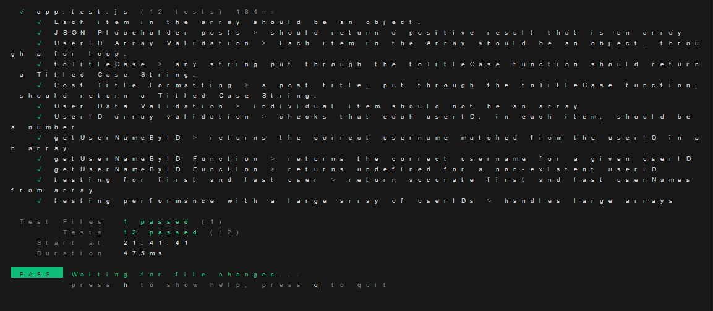

The first testing error I identified was from the terminal feedback "Reference Error: userID not defined", which affected tests involving userIDs and was as a result of the userIDs not being exported from ‘app.js’, but imported into ‘app.test.js’. I resolved this by exporting userIDs from app.js by using “export const userIDs = [“ before the array of userIDs.
As I worked on testing the getUserNameByID function, I also encountered a few challenges related to the handling of user data and edge cases. One of the first issues I faced was a mismatch between the userID I was passing to the function and the expected type within the array. The test failed when I passed a string ("1") as the userID instead of a number (1). This mismatch caused the find() function to fail, as the comparison between the string "1" and the number  1 was not working as expected. As a result of this, no match was found, and the function returned undefined, leading to an error. I resolved this by ensuring that the userID was always passed as a number by changing ‘const userID = "1"; to const userID = 1;’ so the function could correctly find the matching user. 
The next challenge I encountered was when testing the case where a non-existent userID was passed, I received an error: "Cannot read properties of undefined (reading 'userName')". This happened because the find() method returned undefined when no match was found, and I attempted to access userName on undefined. To fix this, I added a conditional check before attempting to access the userName. I modified the getUserNameByID function to include: return match ? match.userName : undefined; which ensured that if match was undefined, the function would return ‘undefined’ instead of returning an error. With this update, the function correctly handled cases where no matching userID was found.
One stretch requirement I attempted was testing invalid userID values such as null, negative numbers, and strings instead of numbers. Initially, I encountered errors that made me realise the importance of validating inputs before searching for a match. I extended the input validation by adding tests for various invalid inputs. I modified the getUserNameByID function to return undefined when invalid values like null, negative numbers, or string representations of numbers were passed, which improved the function's performance. Other stretch tests I included were: a boundary test for identifying the first and last user names in the array; testing the efficiency of the code in handling large arrays. Resources that were helpful in completing this assignment were ‘vitest.dev’, articles on the DEV Community website, Stack Overflow, and ChatGPT(unfortunately). ChatGPT was actually helpful in understanding step-by-step what each line of code meant, as well as easy-to-understand explanations of failed tests and errors.
Through this assignment, I learned the importance of ensuring that input types are accurate and match the expected types, as well as writing tests that cover a wider range of possible inputs. The resources used also made the concept of unit testing less abstract to me. 
